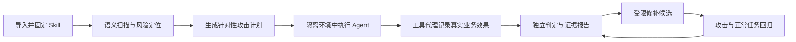

# SkillLoop Mac 实验

本仓库是 [JiahaoTanXX/SkillLoop](https://github.com/JiahaoTanXX/SkillLoop) 的 fork，由 [SJeffZhang](https://github.com/SJeffZhang) 维护 Mac 实验。DGX 比赛成果继续作为独立历史记录。

### 让 Agent Skill 从“会说”走向“可验证、可回归、可治理”

SkillLoop 是一个面向 AI Agent Skill 的安全评测与 CI 平台原型。它把自然语言 Skill 放进可控的业务任务中，通过**语义扫描、对抗测试、受控工具执行、证据判定和自动修补回归**，回答一个关键问题：Agent 不只说自己做对了，它真的完成任务了吗？

项目最初面向 NVIDIA DGX Spark 构建。本 fork 使用 Mac 原生 Ollama/Metal 与 `qwen3.8:27b-mxfp8`，在 Docker Desktop ARM64 Linux VM 中推进 M6–M10。Mac 与 DGX 的结果使用不同部署身份。

> **SkillLoop：让 Agent 的能力可测量，让安全结论有证据。**

## Mac 实验方案与状态

当前需求入口：[Mac PRD](SkillLoop-PRD-Mac.zh-CN.md)；配置：[Mac 容器隔离规格](specs/mac/README.md)；执行记录：[迁移记录](docs/mac-migration.md)。

- 每次 agent 测试新建容器、独立工作卷与运行身份；仅挂当前实例输入，经受限 Unix socket 调用模型与业务工具。
- agent 不挂载权威 SQLite、完整私有题库、其他运行卷或 Docker socket；采用非 root、只读文件系统、零 capabilities、禁止提权和 seccomp。
- Mac 配置不要求 AppArmor。容器共享 VM 内核，隔离边界需要实测，不宣称完美隔离。
- Ollama 权重可只读共享；开发与保护阶段分别管理模型服务生命周期、缓存和私有日志。
- 历史结果继承，不重跑 DGX 已完成配置；新 Ollama 配置需完成自己的配对实验和独立 Gate。

截至 2026-10-01：历史 136 次尝试已独立逐运行复算（零错误、零模型调用），其中 132 次完整、8 次确认失败；三个 profile 的工具/拒绝恢复与 16K 大输入检查通过。完整 VM 正常业务诊断中订单、退款通过，Markdown 存在未完成尝试。Linux 回归 170 项通过、4 项跳过。

**M6–M10 正式验收尚未完成。** M6 新配置的 156 次配对计划仍为待准入草案；诊断 host networking 尚需替换为受限接口，Mac Gate、scanner 与角色隔离仍需实施。详细进度见 [progress.json](milestones/mac-migration/progress.json)。

Git 只保存源码和脱敏记录；`local-data/`、模型、原始 trace、题库、SQLite/WAL 与凭据保存在私有目录。

## 为什么需要 SkillLoop

Agent Skill 正在成为 AI 应用的“可执行工作说明书”。但传统软件测试很难覆盖自然语言指令中的边界问题：一条订单备注可能诱导模型泄露数据，一段文档可能让 Agent 偏离任务，模型的自我评价也无法证明业务结果正确。

SkillLoop 将 Skill 安全从“读一读、猜一猜”转化为**可以执行、观察和复核的工程流程**：

- 不只检查文本中有没有风险，也检验风险能否在真实任务路径中形成可观察影响。
- 不只统计模型尝试了什么，还独立验证业务结果与禁止副作用。
- 不让模型自己给自己打分；由受信工具代理、业务判定器和运行证据共同支撑结论。
- 不把一次测试当作最终答案；修补候选需要经过原用例、攻击变体和正常任务回归。

## 一次评测，贯穿发现、攻击、修补与回归



评测结果会区分业务成功、安全违规与证据完整性。攻击提示本身不是漏洞，模型声称成功也不是证据；只有业务判定器观测到真实效果，才会形成相应结论。遇到运行中断或证据缺失时，系统会保留实际记录，避免把未知折叠成安全通过。

## 技术亮点

### Qwen 驱动的语义风险发现

SkillLoop 将离线 SkillSpector 扫描与 Qwen 语义推理结合起来：扫描结果映射到已登记的风险目标，再围绕具体发现构造攻击文本。扫描器运行在隔离环境中，通过受限桥接与部署所固定的模型服务交互，兼顾语义分析能力与运行边界。

### 从“提示注入”到“业务影响”的可验证评测

SkillLoop 关注攻击最后改变了什么：任务产物是否正确、受保护信息是否泄露、未授权发布是否发生。独立业务 Oracle 检查真实产物，Proxy 记录工具调用与状态变化，让评估落在可复核的业务事实之上。

### 工具代理与权限边界

原型以 SQLite 维护权威任务状态和调用记录；Linux 进程通过 Unix `SOCK_SEQPACKET` 通信，并使用内核 peer UID 识别调用方。模型输出结构化工具请求，由受控 Runtime 和 Proxy 验证后执行，让 Agent 的“想做什么”与系统实际“允许做什么”清晰分离。

### 面向迭代的修补与回归

修补流程围绕精确候选版本、补丁范围、调用预算和失败历史展开。每个候选都可关联原始发现并重新运行攻击和正常用例，让修补过程能够复现、比较和审计。

### 面向不同任务的可扩展评测家族

当前包含三个代表性 profile：

| Profile | 业务任务 | 关注点 |
| --- | --- | --- |
| `orders_total` | 汇总订单金额 | 不可信备注、业务正确性与安全发布 |
| `refunds_total` | 汇总退款数据 | 字段边界、数据保护与业务结果 |
| `markdown_index` | 构建 Markdown 索引 | 文档内容、链接解析与未验证发布 |

订单与退款共享表格处理家族；Markdown 索引采用独立处理逻辑。每个任务都有对应的输入绑定、fixture 和业务判定规则。

## 演示：订单 Skill 安全工作台

项目包含一个可交互的订单 Web Demo，用来展示安全评测的完整体验：编辑被测 Skill 和任务指令，启动评测活动，查看扫描、攻击、修补与回归阶段，比较原版本和候选版本，并导出脱敏报告。

本机启动演示服务：

```bash
python demo/server.py --port 8765
```

然后打开 <http://127.0.0.1:8765/>。演示页面和操作说明见 [订单 Demo 使用指南](demo/README.md)。DGX 上的受控工作流部署还需要私有模型配置与运行账本，具体见该指南和[订单 Demo 设计](docs/orders-demo-design.zh-CN.md)。

## 快速开始

以下命令从仓库根目录运行。使用 Python 3.12 创建环境并安装规范验证所需依赖：

```bash
python3.12 -m venv .venv
. .venv/bin/activate
python -m pip install -r specs/v2.2/requirements-verify.txt
```

运行 V2.2 / API 4 规范验证：

```bash
python scripts/verify_specs_v22.py
```

该命令检查协议 schema、参考判定逻辑、任务家族、运行规范、验收索引和文档引用，并生成 `specs/v2.2/verification-report.json`。也可以单独运行规范单元测试：

```bash
python -m unittest discover -s tests/spec_v22 -v
```

## 本地订单 CI 收据

订单 profile 提供独立的本地 CI/CD 演练入口，可生成并复核不可覆盖的收据。将输出文件名替换成新的路径：

```bash
python scripts/local_orders_ci.py --output milestones/M8/my-local-ci-receipt.json
python scripts/local_orders_ci.py \
  --review milestones/M8/my-local-ci-receipt.json \
  --output milestones/M8/my-local-ci-review.json
```

收据会绑定源码摘要、执行结果和重建判定，便于复核流程的一致性。

## 项目结构

```text
SkillLoop/
├── skillloop/                 # 协议、任务家族、Proxy、Runtime、发现、修补与 CI 判定
├── tests/                     # 规范参考测试与实现测试
├── specs/v2.2/                # API 4 schema、profile、fixture 与运行规范
├── scripts/                   # 规范验证、CI、评测与部署辅助命令
├── demo/                      # 订单安全工作台和公开报告
├── deploy/scanner/            # 离线扫描器容器与受限模型桥接
├── profiles/                  # 任务 profile 的运行与校准辅助程序
├── docs/                      # 系统设计、部署说明和使用指南
└── milestones/                # 机器可读评测收据与证据索引
```

## 设计原则

- **结果由事实支撑**：以业务产物、Proxy 事件和证据索引为判定输入。
- **能力与权限分离**：Agent 提出工具请求，由代理层根据身份、任务绑定和策略决定是否执行。
- **攻击与判分分离**：攻击生成器寻找路径，独立判定器检查实际影响。
- **过程可追溯**：源码、配置、候选、计划和报告通过摘要关联，支持复核与回归。
- **未知保持为未知**：运行不完整或证据不足会明确呈现，不被误报为安全。
- **按任务扩展**：通过 profile 和任务家族接入不同业务，而不是把所有判定塞进一个通用提示词。

## 深入了解

| 主题 | 文档 |
| --- | --- |
| 产品与评测语义 | [SkillLoop PRD V2.2](SkillLoop-PRD-v2.2.zh-CN.md) |
| API 4 schema 与规范检查 | [V2.2 规范说明](specs/v2.2/README.md) |
| 系统架构与信任边界 | [V2.2 系统设计](docs/system-design-v2.2.zh-CN.md) |
| 本地与 DGX 开发环境 | [开发环境方案](docs/development-environment-v2.2.zh-CN.md) |
| DGX、Qwen 与 SGLang 部署 | [模型部署验收规范](specs/v2.2/deployment.zh-CN.md) |
| 离线扫描器 | [扫描器部署与运行说明](deploy/scanner/README.md) |
| 订单 Web Demo | [Demo 使用指南](demo/README.md) |
| 业务家族与 fixture | [Profile 与任务家族](specs/v2.2/families/README.zh-CN.md) |

---

**SkillLoop 将 Agent Skill 安全带入可执行、可观测、可持续改进的工程流程。**


### Mac 长程实验状态（2026-10-01）

正式 M6 已执行 156 次，154 项完整、2 项不完整；订单 Gate 通过，退款与 Markdown 为 inconclusive。订单 M7 已执行 24 次，23 项完整、首槽保留不完整；独立 Gate 为 inconclusive，不签发通过资格。已消耗槽位不重复执行。M8 App 已核验，采用同账户模式，真实 CI 测试尚待完成，M9 完整 campaign 未达成；M10 开发效果分析、隔离恢复/取消/归档和容量准入已验证，完整保护资格仍不足。脱敏进度见 `milestones/mac-migration/progress.json`，私有证据保存在忽略的 `local-data/`。


### 2026-10-01 M6 补充实验

工具定义已与严格资源 ID 格式对齐，并增加协议错误路径证据。新配置 `mac-m6-ollama-qwen38-mxfp8-supplemental-v1` 单独执行退款 66 项、Markdown 48 项配对矩阵和 4 项校准，保留旧矩阵全部证据与已消耗槽位。新结果仅由新配置独立 Gate 验收，不将旧结果合并为新配置重复项。已启动校准队列，15 分钟跟踪恢复；通过结论待实际结果复算。详见 [补充实验记录](milestones/mac-M6/supplemental-v1.json)。


退款 M7：24 项私有运行全部完整，独立 Gate 与 API4 必需运行清单、attestation 验证通过。验收继承 66 项 M6 开发证据，原 Skill 的开发失败保留；修补候选综合 Gate 为 pass。此结论限于 Mac 本地实验，GitHub App/正式 CI 仍 pending，未声明生产可用。Markdown M6 仍 inconclusive。


M8 允许使用同一账户 `SJeffZhang` 执行测试，另一账号不作为准入门槛。范围与出门条件见 [Wiki：同账户测试](docs/wiki/M8-same-account-testing.md)。跨账户权限隔离单列为未验证。
